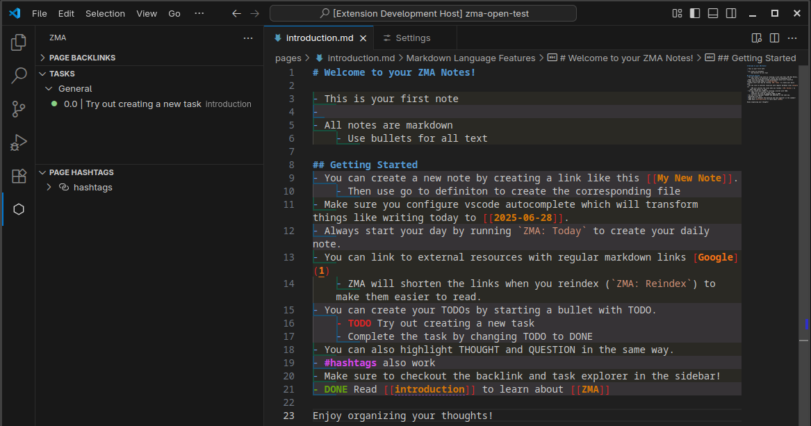

# ZMA - Markdown Note Taking in VS Code

ZMA is a VS Code extension for note-taking with Markdown. It integrates advanced features directly into your Markdown files, assisting with organization, navigation, and task management.

## Features

*   **Markdown Integration**: Supports standard Markdown format within VS Code.
*   **Wiki-Style Linking**: Connect notes using `[[wiki-style links]]`. "Go to Definition" functionality allows navigation between linked notes.
*   **TODO Support**: Manage tasks within notes. Commands are available to snooze, reset snooze, and adjust task priority.
*   **Navigation**:
    *   **Backlinks Explorer**: Displays notes that link to the current file.
    *   **Hashtag Explorer**: Allows browsing and navigation of notes by hashtags.
    *   **Task Explorer**: Provides a view and management interface for all tasks.
*   **Git Integration**: Includes commands for committing and pushing changes, and removing empty files.
*   **Autocomplete**: Autocomplete for links, headings, and hashtags. 

## Getting Started

1.  **Install the ZMA extension** by downloading and adding the `.vsix` file from releases. 
2.  **Open a folder** an empty folder in VS Code.
3.  **Run ZMA: Introduction** from your VS Code commands (usually accessed through `ctrl/cmd + shift + P`)

## VS Code Commands

Commands can be accessed via the VS Code Command Palette (`Ctrl+Shift+P` or `Cmd+Shift+P`).

### General Commands

*   **ZMA: Today** (`zma.today`): Opens or creates today's daily note.
*   **ZMA: Yesterday** (`zma.yesterday`): Opens yesterday's daily note.
*   **ZMA: Reindex** (`zma.reindex`): Rebuilds the internal index of ZMA data.
*   **ZMA: Refresh Explorers** (`zma.refreshexplorers`): Updates the Backlinks, Tasks, and Hashtags explorers.
*   **ZMA: Format All Files** (`zma.formatAllFiles`): Applies Markdown formatting to all ZMA notes.
*   **ZMA: Quick Open Link** (`zma.quickOpenLink`): Searches and opens ZMA wiki-style links.
*   **ZMA: Quick Open Href** (`zma.quickOpenHref`): Searches and opens external web links (hrefs) from notes.
*   **ZMA: Run Cli Action** (`zma.runCliAction`): Executes a predefined ZMA command-line interface action.

### Git Integration Commands

*   **ZMA: Commit and Push** (`zma.git.commitandpush`): Stages all changes, commits them, and pushes to the Git repository.
*   **ZMA: Remove Empty Files** (`zma.git.removeemptyfiles`): Identifies and removes empty files within the Git repository.